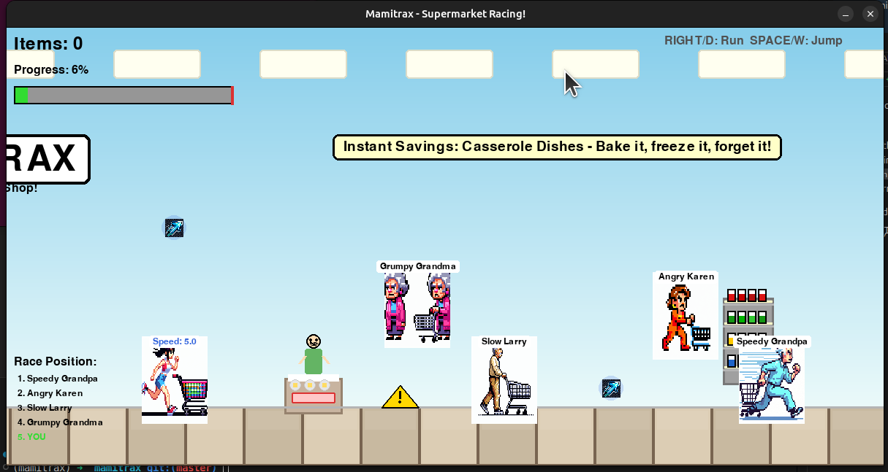

# Mamitrax 🛒💨



A hilarious horizontal racing game where you compete against grumpy boomer shoppers to reach the supermarket checkout first!

## TL;DR - Quick Start 🚀

**Want to play right now?**

1. Download this folder to your computer
2. Open a terminal/command prompt in the folder
3. Type: `python main.py`
4. Play! Use arrow keys or WASD to move, SPACE to jump

That's it! The game works out of the box with simple graphics. If you want fancy AI-generated characters, see the optional steps below.

---

## Features

- **Side-scrolling racing action** - Race from left to right through a supermarket
- **4 unique rival characters** - Compete against Grumpy Grandma, Speedy Grandpa, Angry Karen, and Slow Larry
- **Collectible items** - Pick up coins, speed boosts, and energy drinks
- **AI-generated graphics** - Beautiful character sprites and backgrounds created with DALL-E 3
- **Physics-based gameplay** - Jump over obstacles and navigate the aisles

## Installation

```bash
# Make sure you're in the project directory
cd /home/ubuntu/projects/mamitrax

# Install dependencies (already done if you used uv)
pip install pygame pillow openai requests
```

## Generating Graphics (Optional)

To generate high-quality AI graphics for the game:

1. **Preview what will be generated** (no API key needed):
```bash
python generate_images.py --dry-run
```

2. Set your OpenAI API key:
```bash
export OPENAI_API_KEY='your-api-key-here'
```

3. Run the image generation script:
```bash
python generate_images.py
```

The script automatically:
- ✨ Extracts character types, items, and UI elements from `main.py`
- 🎨 Generates appropriate AI prompts for each element
- 🖼️ Creates ~14 AI-generated images (5 characters, 3 backgrounds, 3 items, 3 UI elements)
- 🔄 Skips images that already exist

**Note:** The game works fine without generated images - it will use simple colored shapes as fallback graphics.

## How to Play

```bash
python main.py
```

### Controls
- **RIGHT / D** - Run forward faster
- **LEFT / A** - Slow down or move back
- **SPACE / W / UP** - Jump

### Objective
Race through the supermarket, collect items, avoid obstacles, and reach the checkout line first! Compete against 4 unique boomer rivals who each have their own racing style.

### Items
- 🪙 **Coins** - Increase your collection count
- ⚡ **Speed Boost** (blue arrow) - Permanently increase your speed
- 🥤 **Energy Drink** (red can) - Temporary speed burst

### Rivals
- **Grumpy Grandma** (Pink) - Steady, moderate speed
- **Speedy Grandpa** (Blue) - Fast and competitive
- **Angry Karen** (Orange) - Aggressive racer
- **Slow Larry** (Tan) - Slowest but unpredictable

## Game Over
- **1st Place** - You beat all the boomers! 🏆
- **2nd-3rd Place** - Podium finish! Not bad! 🥈🥉
- **4th-5th Place** - Those boomers got you! Try again! 😅

Press **R** to restart or **Q** to quit after finishing.

## Development

Built with:
- **Pygame** - Game engine and graphics
- **OpenAI DALL-E 3** - AI-generated artwork
- **Python 3.11+** - Programming language

Enjoy racing those gringe boomers! 🛒💨
